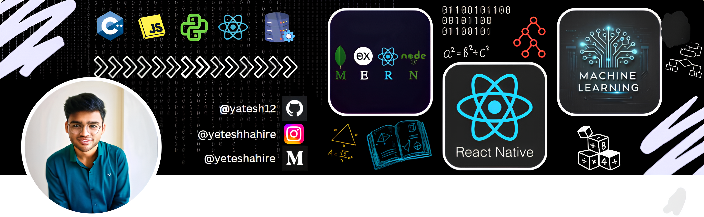

  
  

    
    
    
    
  

🚀 About Me

- **Currently working on** DataBits — an AI-powered data-preprocessing platform built with React, Tailwind CSS, TypeScript, Flask, and Python.  
- **Looking to collaborate on** full-stack AI/ML projects that marry intuitive UX (React / React Native) with robust, real-time backends (Node.js / Express, REST APIs).  
- **Seeking help with** productionizing ML pipelines and optimizing real-time data ingestion/reporting workflows (Python, SQL, Docker).  
- **Currently learning** advanced large-language models and cloud-native deployment patterns (Docker, Kubernetes, GCP AI services).  
- **Ask me about** interactive Power BI dashboards, designing Node.js RESTful APIs, or tackling competitive algorithms in C++.  
- **Fun fact:** Semi-finalist in Indian Silicon Valley Challenge (Top 15/1 800+) and boosted MUN camp attendance by 20% as Camp Ambassador.
---

🏆 GitHub Trophies

  

---

💻 Tech Stack

  <!-- Languages & Runtimes -->
  
  
  
  
  
  <!-- Frontend -->
  
  
  
  
  <!-- Backend & API -->
  
  
  
  
  
  <!-- Databases -->
  
  
  
  
  
  <!-- Data Science & ML -->
  
  
  
  
  
  <!-- Tools & Platforms -->
  
  
  
  
  

---

  
<strong>📂 Featured Projects</strong>

  - **DataBits**: AI-powered data profiling & preprocessing platform.  
    <small>React · Tailwind · TypeScript · Flask · Python · ML</small>
  
  - **Neuron**: Hybrid social media mobile app.  
    <small>React Native · Expo · TypeScript · Modular Architecture · UI.UX</small>

  - **FinPlan AI**: Personalized financial planning assistant.  
    <small>Python · React · LLMs · RAG · Vector DB · ML</small>
  
  - **React E-Commerce Frontend**: Multi-vendor marketplace UI.  
    <small>React · Node · UI/UX · Vendor Dashboard</small>

